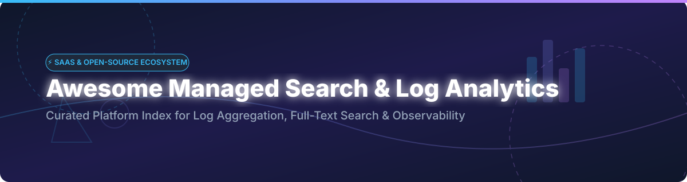

# Awesome-Managed-Search-Log-Analytics

  
  

## 🚀 Top Managed Search & Log Analytics Ecosystem

**Curated List of SaaS Products & Open-Source GitHub Projects**  
*Focused on Log Aggregation, Full-Text Search, Telemetry Pipelines & Self-Hosted Observability Backends*  

**Last updated: October 2026**

---

Welcome to the definitive awesome list for **managed search and log analytics platforms** and high-performance **open-source log search engines**. This repository indexes leading solutions that ingest, index, query, analyze, and visualize logs and events at enterprise scale — powering cloud observability, security analytics (SIEM), and operational intelligence without infrastructure friction.

---

## 📑 Table of Contents

- [📊 Market Insights & Landscape](#-market-insights--landscape)
- [☁️ SaaS / Hosted Platforms](#%EF%B8%8F-saas--hosted-platforms)
- [🔓 Open-Source GitHub Projects](#-open-source-github-projects)
- [🤝 How to Contribute](#-how-to-contribute)
- [⚠️ Disclaimer](#%EF%B8%8F-disclaimer)
- [💖 Support & Sponsorship](#-support--sponsorship)
- [📈 Star History](#-star-history)

---

## 📊 Market Insights & Landscape

The global log analytics and search software market is estimated at **$6.2 Billion** and is projected to reach over **$14.8 Billion by 2030** (growing at a ~15.4% CAGR). 

> [!NOTE]
> **Market Dynamics:** The sector is **moderately fragmented**. Mega-cap hyperscalers and observability leaders (AWS, Splunk/Cisco, Datadog, Elastic) hold dominant positions in enterprise SaaS. However, rapid innovation in modern columnar storage (ClickHouse, Parquet) and sub-second object storage engines (Quickwit, OpenObserve) enables high-growth open-source alternatives to continually capture developer share, keeping the market competitive rather than a winner-take-all monopoly.

---

## ☁️ SaaS / Hosted Platforms

The table below lists top commercial SaaS log analytics platforms, sorted by estimated company size / market valuation (descending):

| Platform | Description & Key Strengths | Company Scale (Valuation / Revenue) | Starting Pricing Tier | Free Tier / Trial Limit |
| :--- | :--- | :--- | :--- | :--- |
| **[Splunk Cloud](https://www.splunk.com/)** | **Enterprise log analytics standard** — deep security correlation, complex queries, massive app ecosystem. *Best for large enterprise SIEM & IT operations.* | **$28.0 Billion** (Acquired by Cisco for $28B; ~$4B annual revenue) | Standard Workload pricing starts at ~$0.15/GB ingested or ~$2,000/year for baseline ingest units. | **14-day free trial** with 5 GB/day indexing limit. |
| **[Amazon OpenSearch Service](https://aws.amazon.com/opensearch-service/)** | **AWS managed OpenSearch** — seamless AWS integration, auto-scaling, serverless option. *Best for AWS-native log analytics.* | **$2.0 Trillion** (AWS parent Amazon market cap; AWS ~$100B annual revenue run-rate) | Managed clusters start at ~$0.024/hour (`t3.small.search`) + $0.10/GB-month EBS storage. | **750 hours/month** of `t2.small.search` or `t3.small.search` + 10 GB EBS (eligible regions/new accounts). |
| **[Datadog Log Management](https://www.datadoghq.com/)** | **Unified telemetry log search** — seamlessly linked with Datadog APM, metrics, and traces. *Best for existing Datadog users.* | **$41.0 Billion** (Public NASDAQ: DDOG; ~$2.6B annual revenue) | Ingestion starts at $0.10 per GB ingested/month; retention indexing starts at $1.70/million log events (3-day retention). | **14-day free trial** with unlimited data volume during evaluation. |
| **[Elastic Cloud](https://www.elastic.co/cloud)** | **Managed Elasticsearch & Kibana** — reference platform for full-text search and ELK observability. *Best for Elastic ecosystem.* | **$8.5 Billion** (Public NYSE: ESTC; ~$1.3B annual revenue) | Standard hosted tier starts at ~$95/month (~$0.13/hour) for managed compute & storage. | **14-day free trial** on AWS/GCP/Azure with full features. |
| **[Sumo Logic](https://www.sumologic.com/)** | **Cloud-native security & log analytics** — automated anomaly detection, log reduction, SIEM. *Best for cloud-first SecOps.* | **$1.7 Billion** (Acquired by Francisco Partners for $1.7B) | Essentials tier starts at ~$3.00/GB ingested per month (Flex pricing model available). | **30-day free trial** + Free plan with 1 GB/day ingest and 1-day retention. |
| **[Logz.io](https://logz.io/)** | **Open-source based observability** — managed OpenSearch, Prometheus, & Jaeger with AI insights. *Best for open-source SaaS.* | **$400 Million** (Estimated valuation; $100M+ venture funding) | Community/Pro pricing starts at ~$0.92 per GB ingested/month with 7-day retention. | **14-day free trial** + Free Community Plan with 1 GB/day ingest and 1-day retention. |
| **[Coralogix](https://coralogix.com/)** | **Streaming telemetry analytics** — analyzes logs in-memory before indexing for cost optimization. *Best for high-volume logs.* | **$350 Million** (Estimated valuation; $142M venture funding) | Pay-as-you-go pricing starts at $0.05/GB for streaming archives & $0.25/GB for standard indexing. | **14-day free trial** with full platform access. |
| **[Mezmo (LogDNA)](https://www.mezmo.com/)** | **Telemetry pipeline & log management** — real-time log parsing, filtering, routing, and search. *Best for telemetry pipelines.* | **$250 Million** (Estimated valuation; $100M+ funding) | Telemetry pipeline starts at $0.35/GB for pipeline processing + $1.50/GB for 30-day log search retention. | **14-day free trial** with full pipeline features. |
| **[Better Stack Logs](https://betterstack.com/)** | **Modern SQL log analytics** — ClickHouse-powered sub-second SQL queries with elegant UI. *Best for modern engineering teams.* | **$150 Million** (Estimated valuation; $28M+ funding from Creandum/Sentry) | Freelancer plan starts at $24/month for 50 GB ingested/month (30-day retention). | **Free forever plan** with 1 GB/month ingestion and 3-day retention. |
| **[Sematext Logs](https://sematext.com/logsene/)** | **DevOps log management** — integrates log search with server and application monitoring. *Best for unified DevOps monitoring.* | **$50 Million** (Estimated valuation; bootstrapped enterprise SaaS) | Basic plan starts at $50/month for 1 GB/day ingest with 7-day retention ($1.60/GB pay-as-you-go). | **14-day free trial** + Free plan with 1 GB/day ingest and 7-day retention. |

---

## 🔓 Open-Source GitHub Projects

The leading open-source search engines, log aggregators, analytical databases, and telemetry pipelines — sorted strictly by GitHub Stars_Count (descending):

| Stars_Count Badge | Project Name & Repository | License | Description & Key Strengths | Primary Use Case |
| :---: | :--- | :---: | :--- | :--- |
|  | **[Meilisearch](https://github.com/meilisearch/meilisearch)** | `MIT` | **Lightning-fast, typo-tolerant search engine** written in Rust. Instant search experience out of the box. | Application Search / E-commerce |
|  | **[ClickHouse](https://github.com/ClickHouse/ClickHouse)** | `Apache-2.0` | **Columnar analytical DBMS** capable of processing billions of log events per second with high compression. | High-Volume Log Analytics Backend |
|  | **[SigNoz](https://github.com/SigNoz/signoz)** | `Apache-2.0` | **OpenTelemetry-native observability platform** combining logs, traces, and metrics under one UI. | Full-Stack Observability & APM |
|  | **[Grafana Loki](https://github.com/grafana/loki)** | `AGPL-3.0` | **Horizontally scalable log aggregation system** inspired by Prometheus. Indexes metadata labels instead of full text for extreme efficiency. | Kubernetes Log Aggregation |
|  | **[Typesense](https://github.com/typesense/typesense)** | `GPL-3.0` | **Fast, in-memory open-source search engine** engineered for instant search and developer productivity. | Site Search & App Analytics |
|  | **[Vector](https://github.com/vectordotdev/vector)** | `MPL-2.0` | **Ultra-fast Rust observability data pipeline** for collecting, transforming, and routing logs and metrics. | Telemetry Pipeline / Log Shipper |
|  | **[OpenObserve](https://github.com/openobserve/openobserve)** | `AGPL-3.0` | **Cloud-native observability platform** built on Parquet & Rust. Delivers up to 140x lower storage costs than ES. | Cost-Effective Log Search & Tracing |
|  | **[Sonic](https://github.com/valeriansaliou/sonic)** | `MPL-2.0` | **Fast, lightweight search backend** written in Rust using minimal memory footprint as an alternative to Solr/Elasticsearch. | Lightweight Full-Text Indexing |
|  | **[ZincSearch](https://github.com/zincsearch/zincsearch)** | `Apache-2.0` | **Lightweight log search engine written in Go**. Uses Vue frontend and serves as a simple ES replacement. | Embedded & Small-footprint Log Search |
|  | **[Apache Doris](https://github.com/apache/doris)** | `Apache-2.0` | **Real-time analytical database** designed for high-concurrency, real-time log search and operational reports. | Real-Time Log Analytics |
|  | **[Apache Druid](https://github.com/apache/druid)** | `Apache-2.0` | **Real-time analytics database** designed for fast slice-and-dice analytics on large log and event streams. | Event Stream Analytics |
|  | **[OpenSearch](https://github.com/opensearch-project/OpenSearch)** | `Apache-2.0` | **Community-driven, open-source search & analytics suite** forked from Elasticsearch 7.10. | Enterprise Search & Log Analytics |
|  | **[Fluentd](https://github.com/fluent/fluentd)** | `Apache-2.0` | **CNCF graduated unified logging layer** for unifying data collection and consumption. | Log Routing & Collection |
|  | **[Quickwit](https://github.com/quickwit-oss/quickwit)** | `Apache-2.0` | **Sub-second search on object storage** (S3/GCS). Rust-based engine engineered for cost-effective log search. | Big Data Log Retention on S3 |
|  | **[Bleve](https://github.com/blevesearch/bleve)** | `Apache-2.0` | **Modern text indexing library for Go**. Performs full-text indexing and search for Go applications. | Embedded Go Search Library |
|  | **[Apache Cassandra](https://github.com/apache/cassandra)** | `Apache-2.0` | **Distributed NoSQL database** offering high availability and linear scalability for heavy write workloads. | Distributed Storage Backend |
|  | **[Fluent Bit](https://github.com/fluent/fluent-bit)** | `Apache-2.0` | **Super fast, lightweight log processor & forwarder** written in C for Kubernetes, IoT, and embedded systems. | Cloud-Native Log Agent |
|  | **[Graylog](https://github.com/Graylog2/graylog2-server)** | `SSPL` | **Centralized log management & SIEM platform**. Fast search, stream processing, and security alerting. | Enterprise Log Management & SIEM |
|  | **[Vespa](https://github.com/vespa-engine/vespa)** | `Apache-2.0` | **Yahoo's open-source engine** for vector search, full-text search, and real-time AI evaluation at scale. | AI Search & Recommendation |
|  | **[Apache Pinot](https://github.com/apache/pinot)** | `Apache-2.0` | **Real-time distributed OLAP datastore** engineered for ultra-low latency analytics on high-throughput event streams. | Low-Latency User-Facing Analytics |
|  | **[Uptrace](https://github.com/uptrace/uptrace)** | `AGPL-3.0` | **Open-source APM tool** powered by OpenTelemetry & ClickHouse for monitoring logs, traces, and metrics. | OpenTelemetry APM & Tracing |
|  | **[Apache Lucene](https://github.com/apache/lucene)** | `Apache-2.0` | **High-performance, full-featured search engine library** written in Java. Powers Elasticsearch, Solr, & OpenSearch. | Search Core Library |
|  | **[OpenSearch Dashboards](https://github.com/opensearch-project/OpenSearch-Dashboards)** | `Apache-2.0` | **Open-source visualization user interface** for OpenSearch (Kibana fork). | Log Visualization & Dashboards |
|  | **[Apache Solr](https://github.com/apache/solr)** | `Apache-2.0` | **Enterprise search platform** built on Lucene featuring distributed indexing, replication, and SQL querying. | Enterprise Search Platform |

---

## 🤝 How to Contribute

Contributions are highly welcome! Help keep this managed search and log analytics ecosystem directory accurate and up to date.

1. Fork this repository.
2. Add or edit entries in `README.md` following the tabular format above.
3. Keep descriptions objective, concise, and focused on core capabilities.
4. Open a Pull Request with a short summary of changes.

---

## ⚠️ Disclaimer

- **Community Curated:** This repository is a community-maintained curated list for informational purposes.
- **Data Privacy & Security:** Log analytics systems process sensitive operational logs, audit events, and user activity. Ensure proper encryption, role-based access control (RBAC), and regulatory compliance (GDPR/SOC2).
- **Licensing Verification:** Pay close attention to open-source licenses (`Apache-2.0`, `AGPL-3.0`, `SSPL`, `GPL-3.0`) prior to commercial deployment.

---

## 💖 Support & Sponsorship

If you found this curated list helpful for your observability, DevOps, or enterprise search architecture, please consider starring, sharing, or sponsoring the project!

- ⭐ **Star this repository** on GitHub to help others discover it.
- 🔀 **Fork & Contribute** to expand the list of managed search and log engines.
- ☕ **Buy me a coffee / Sponsor:** If you'd like to support my open-source work, check out my [GitHub Sponsors Dashboard](https://github.com/sponsors/ishandutta2007).

---

## 📈 Star History

---

  <b>Built for SREs, Observability Engineers, SecOps, and Systems Architects</b> 
  <i>Let's make managed search and log analytics more open, transparent, and cost-effective.</i>

